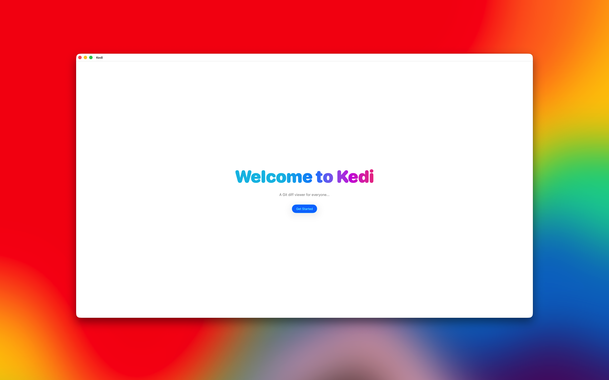
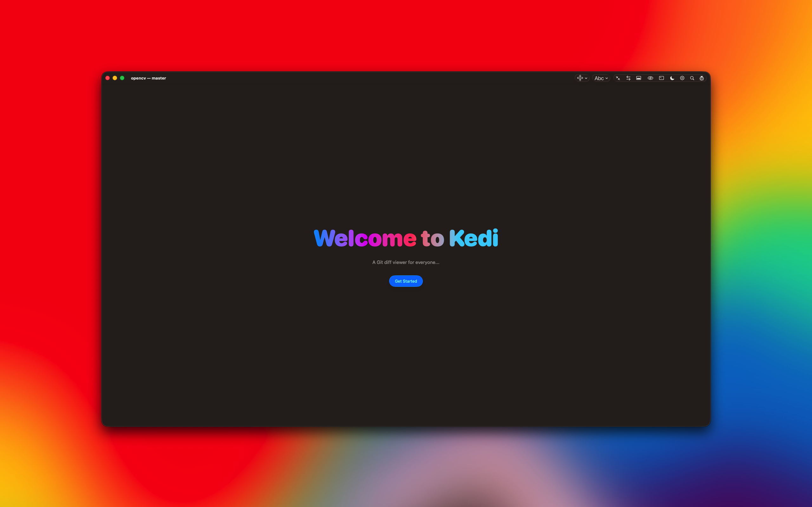

#  Kedi.app 

Meet Kedi, a standalone macOS application built exclusively for viewing Git diffs with complete clarity and speed. Written entirely in SwiftUI and hardware-accelerated using Metal, Kedi provides a responsive, native environment to review code changes without unnecessary clutter.

Whether you need a quick overview of your working directory or a detailed analysis of a specific commit, Kedi integrates directly with your local Git repository to deliver instant insights.

<video src="./assets/kedi_01.mp4" width="256" controls style="vertical-align: middle;"></video>

✨ CORE FEATURES

• Four Diff Layouts: Switch easily between Side-by-Side, Inline, Collapsed, and Full views to match your preferred review style.
• Code Minimap: Navigate through massive source files quickly with a high-level visual blueprint of your modifications.
• Native Git Integration: Connects directly to your local repository data and Git servers to display current modifications seamlessly.
• Visual Personalization: Beautiful native Dark Mode integration and customizable Theme Support that look right at home on macOS.
• Standalone Application: Runs independently on your Mac without requiring terminal wrappers or heavy background runtimes.

🛠️ UNDER ACTIVE DEVELOPMENT
We are hard at work expanding Kedi's capabilities. Direct in-app code editing is coming in a future update!

🔒 PRIVACY & SECURITY FIRST
Kedi respects your source code and your workflow. 
• Zero Telemetry: No background tracking, no user analytics, and no metric collection. 
• Direct Connections: Network traffic is strictly limited to your designated Git servers to fetch and sync code using your secure credentials.
• No Backdoors: Your code never leaves your machine or your authorized repositories.

